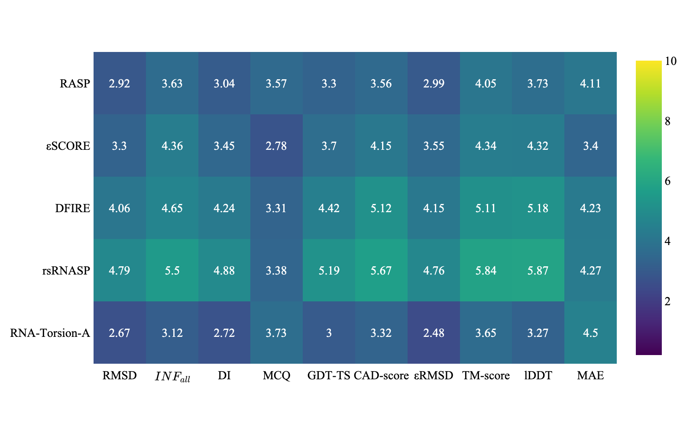
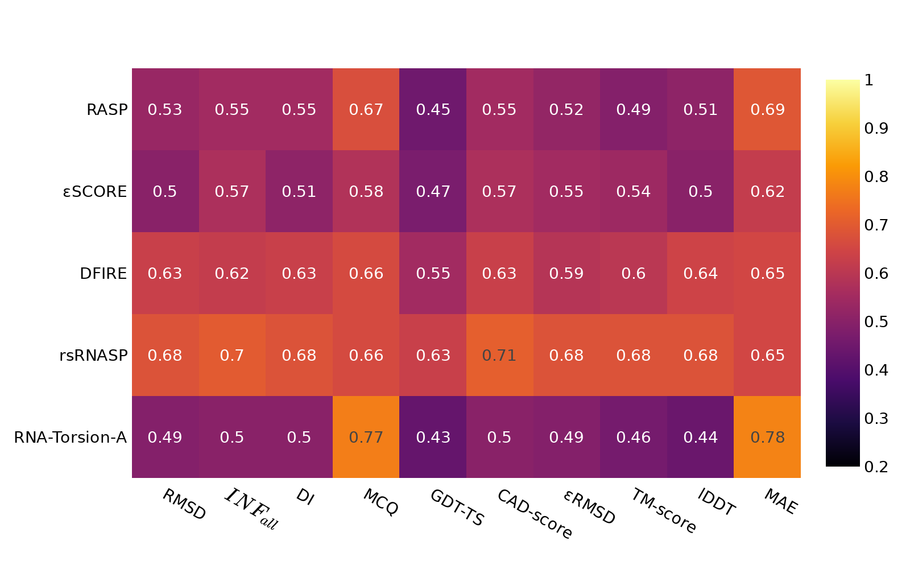

# RNA-TorsionBERT visualisation

This repository contains the code for the visualisation of the [RNA-TorsionBERT](https://github.com/EvryRNA/RNA-TorsionBERT/tree/main) work. 

## Installation

You just need to install the requirements using the following command line:

```bash
pip install -r requirements.txt 
```

## Data

We only provide the data in forms of torsional angles. The conversion from `.pdb` files to angles was done using this [DSSR fork](https://github.com/EvryRNA/rna_angles_prediction_dssr).

The data are organized as follows:
- `data/NATIVE`: contains the native torsional angles for the structures. It has the training set, the validation set and the two test sets. 
- `data/DECOYS`: contains the decoys torsional data for the three test sets.


## Usage

### Decoys visualisation

To visualise the averaged `ES` and `PCC` over the three decoy test sets, you can run the following command line:

```bash
TO DO
```
It will give you the following results:

ES heatmap scoring functions             |  PCC heatmap scoring functions
:-------------------------:|:-------------------------:
  |  


## Citation

TO BE COMPLETED