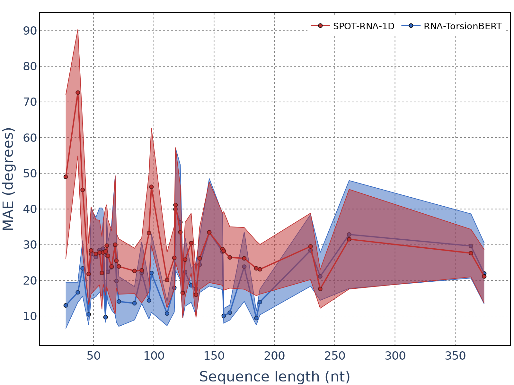
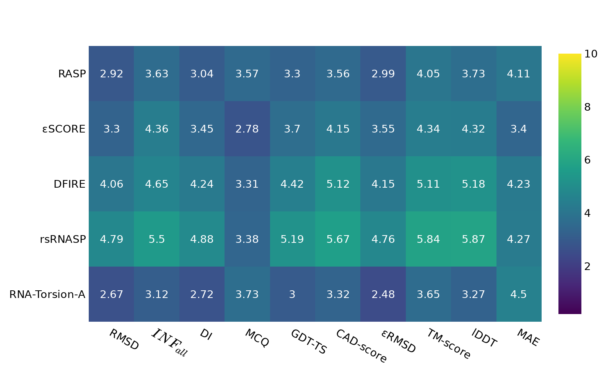

# RNA-TorsionBERT visualisation

This repository contains the code for the visualisation of the [RNA-TorsionBERT](https://github.com/EvryRNA/RNA-TorsionBERT/tree/main) work. 

## Installation

You just need to install the requirements using the following command line:

```bash
pip install -r requirements.txt 
```

You can also run it inside a `Docker` using:
```bash
make docker_run
```
or 
```bash
docker build -t rna_torsionbert_viz .
docker run -it -v ${PWD}/data:/app/data -v ${PWD}/img:/app/img rna_torsionbert_viz
```

## Data

We only provide the data in forms of torsional angles. The conversion from `.pdb` files to angles was done using this [DSSR fork](https://github.com/EvryRNA/rna_angles_prediction_dssr).

The data are organized as follows:
- `data/NATIVE`: contains the native torsional angles for the structures. It has the training set, the validation set and the two test sets. 
- `data/DECOYS`: contains the decoys torsional data for the three test sets.


## Usage

### Data visualisation 

To visualise the torsional distribution of the angles over the pre-training, training, validation and test sets, you can run the following command line:

```bash
make plot_data:
```
or 
```bash
python -m src.viz_cli --method="data"
```

It will give you the following visualisation:


To get information about the dataset sequences, you can use:
```bash
make plot_stats
```
or 
```bash
python -m src.viz_cli --method="stats"
```


### RNA-TorsionBERT visualisation

To visualise the different performances of the `RNA-TorsionBERT` model, you can use: 

```bash
make plot_model
```
or 
```bash
python -m src.viz_cli --method="model"
```

It will give you the following results:

Distribution of MAE             |  Mean MAE per RNA length
:-------------------------:|:-------------------------:
  |  


### Decoys visualisation

To visualise the averaged `ES` and `PCC` between **scoring functions** and **metrics** over the three decoy test sets, you can run the following command line:

```bash
make plot_decoys
```
or 
```bash
python -m src.viz_cli --method="decoys"
```
It will give you the following results:

ES heatmap scoring functions             |  PCC heatmap scoring functions
:-------------------------:|:-------------------------:
  |  

It will also give the `ES` and `PCC` between **metrics** over the three decoy test sets:

ES heatmap metrics             |  PCC heatmap metrics
:-------------------------:|:-------------------------:
  |  

## Citation

TO BE COMPLETED